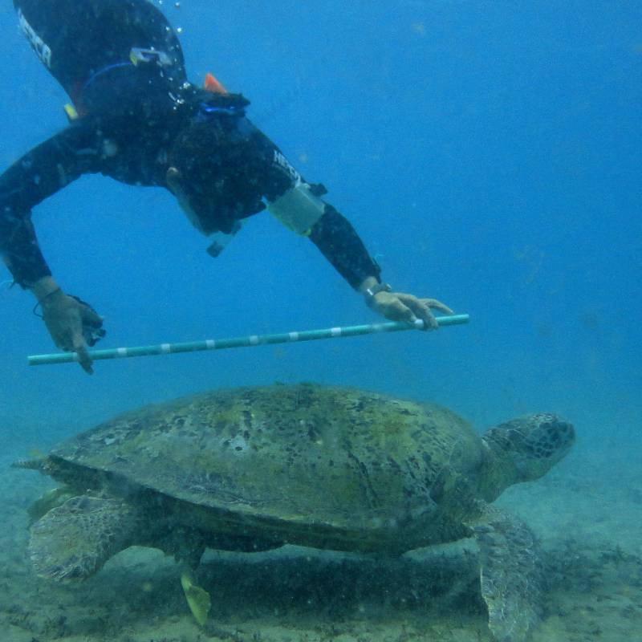
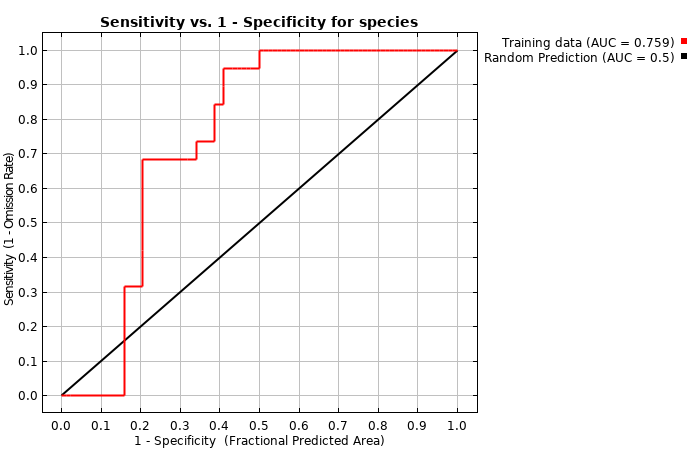

```{r setup, include=FALSE}
knitr::opts_chunk$set(echo = TRUE)
suppressPackageStartupMessages(library(tidyverse))
suppressPackageStartupMessages(library(turtlewatch))
```
```{r banner, fig.align="center", echo = FALSE }

```

## Overview

Systematic surveys provide evidence for both presence and absence of a given species.  A systematic survey typically records the counts of a species found at specified locations. Researchers can have high confidence in the meaning of a survey sample when no species is found: **"yes, we have no bananas!"**. 

On the other hand, presence only surveys provide no information about where a species is not found: **"we have no idea if we have no bananas"**.  Citizen science projects are typically presence only surveys where only positive observations are reported.  Recent work in ecological modeling has provided bith justification and frameworks for using presence only datasets to model and forecast species distributions. We use the  [MaxEnt](http://biodiversityinformatics.amnh.org/open_source/maxent/) algorithm where presence only data can be modeled if suitable randomly selected background information can be provided. The [dismo](https://CRAN.R-project.org/package=dismo) package provides a very simple wrapper around `MaxEnt` to facilitate it's use within `R`.

[TurtleWatch Egypt](https://www.anecdata.org/projects/view/226) was a project of [Hurghada Environmental Protection and Conservation Association](https://en.wikipedia.org/wiki/Hurghada_Environmental_Protection_and_Conservation_Association) which seems to have lost its online presence.  3197 *in situ* observations 
were reported from 2002 through 2017, although efort was concentrated in 2011-2013 and again in 2016. Observations were primarily from the shorelines of the upper Red Sea.

```{r when, echo = FALSE}
obs <- turtlewatch::read_obs(simplify = FALSE)
years <- as.numeric(format(obs$sighted, "%Y"))
ggplot2::qplot(years, geom="histogram", 
               main = 'Turtle Watch Egypt observations',
               ylab = 'Counts',
               binwidth = 1)
```

```{r where, echo = FALSE}
leaflet::leaflet(obs) %>%
  leaflet::addTiles() %>%
  leaflet::addCircleMarkers(clusterOptions = leaflet::markerClusterOptions())
```

We chose to build presence-only models using observations from 2011-2013 to build prediction maps for 2016.  In the interest of keeping the `turtlewatch` package small, we chose to build models and predictions for 8-day intervals. The 8-day interval is common for [oceanographic satellite distributions](http://oceancolor.gsfc.nasa.gov). We also chose to model only two species, [Green sea turtles](https://en.wikipedia.org/wiki/Green_sea_turtle) and [Hawksbill sea turtles](https://en.wikipedia.org/wiki/Hawksbill_sea_turtle) as they each account for about half of the observations.

## Observations

Observational data can be downloaded from the citizen science platform, [Anecdata](https://www.anecdata.org), as either tabular CSV or [geojson](https://geojson.org) formats either of which is easily imported into R using the [sf](https://CRAN.R-project.org/package=sf) package.  We reduced the dataset to cover only the species and years of interest.  Note that we only need the time and location information to proceed, but we have included `species` and `layer` which refers to the beginning of the 8-day week upon which each observation falls.

```{r obs}
(obs <- turtlewatch::read_obs())
```

## Predicitor variables (aka environmental data)

While any environmental variables that cover the same space and time as the observations can be used, for our purposes we looked for gridded data that is simple to access and interpolate. We chose to use data assembled by NASA from the [MODIS-Aqua](https://aqua.nasa.gov/modis) satellite as distrubited by the [Ocean Biology Processing Group](http://oceancolor.gsfc.nasa.gov). While the MODIS-Aqua platform generates a lot of environmental measurements we chose just three: chlorophyl-a (CHL), daytime sea surface temperature (SST) and nighttime sea surface temperature (NSST).  Each of these is averaged into 8-day intervals and is easily accessible online.  We decided to store these within the package as multilayer GeoTIFF images. These are accessed within R using the [raster](https://CRAN.R-project.org/package=raster) package as objects we call `raster_stacks`.  Below we show SST for the very first 8-day interval.

```{r preds}
PP <- turtlewatch::read_rasters()
leaflet::leaflet(obs) %>%
  leaflet::addTiles() %>% 
  leaflet::addRasterImage(PP[['SST']][['A2011001']], opacity = 0.8)
```

## Modeling

Modeling requires selection of suitable background points, and then the assembly of enviromental variables for each observation and backgound record. 

### Selecting background 

Background, quasi-randomly selected to avoid locations of observations, is used as a proxy for abscence records. It is a somewhat tricky step, as the observations we wish to avoid are distributed in both time and space. An additional challenge is that satellite data, even avgeraged into 8-day bins, can be have missing data (cloud cover, turbidity, smoke from fires, etc) which we hope to avoid.  We have developed a package [rasf](https://github.com/BigelowLab/rasf) which provides tools for background selection.  Skipping over a lot of details (see `model.R`), the call for backgound point selection looks like this.

`bkg <- rasf::randomPoints(raster_stack, points_to_avoid)`

We want to avoid the locations of the input points as well as the locations of missing data in the multilayer raster_stack.  Oddly enough, that means choosing to use the noisest raster_stack, in our case CHL.  That way we minimize our chances to picking locations that might also be missing in the other two raster_stacks (SST and NSST).

### Model building

The entire effort to build the model is passed on to a java application with a simpe command (here oversimplified for clarity). Each of the two input arguments are simple data frames with CHL, SST and NSST columns.  Note the time and location are not included (although they could be if that is an import factor).  Maxent saves the model to disk at the specifed location.

`model <- dismo::maxent(presence_data, background_data, output_path)`

Model output can be viewed as an [HTML](inst/model/209/maxent.html) report and it includes a variety of metrics including some graphics such as the one below.  Note that the model report also includes an assement of how much each variable contributes to the strength of the model.

```{r modelgraphcis, fig.align="center", echo = FALSE }

```

## Prediction

Once a model is built, predictions can be made using any dataset that includes the same predictor variables.  The call for a prediction is very simple; the function is robust enough to accept a variety of input predicitor forms including `data.frame` and `raster_stack`. The returned value is in the same form as the input (so inputting a `raster_stack` yields as `raster_stack`) with values ranging form 0 to 1.  It is important to note that the values represent likelihood or presence.  We like to think that when we forecast citizen reports of turtles, that we are not forecasting turtles but instead we are forecasting the likelihood that a person will observe and report a turtles.

`prediction <- dismo::predict(model, predictors)`

Likelihood predictions are easily mapped.

```{r prediction}
turtlewatch::draw_woy("2016-02-10", species = 'Hawksbill')
```
